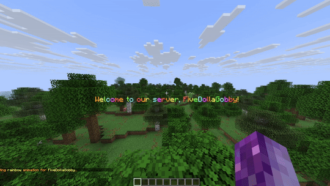

# WelcomeMessages v1.3.4


A clean, lightweight welcome plugin for Minecraft servers that actually works. No bloat, no premium features locked behind paywalls, just good old-fashioned join/quit messages done right. Now with 12 amazing text animations, enhanced security, and perfect compatibility!

## Why Another Welcome Plugin?

Look, I needed a welcome plugin that wasn't from 2018, didn't break every update, and didn't try to do 500 things at once. Most welcome plugins are either abandoned, premium for basic features, or so bloated they cause lag. This one just works.


## What It Does

- **Smart Messages** - Different messages for new players vs returning ones
- **Rank Support** - VIPs get VIP treatment (if you want)
- **12 Text Animations** - Typing, fade, slide, wave, rainbow, glitch, typewriter, bounce, shake, pulse, matrix, scramble
- **Fancy Effects** - Particles, sounds, titles, fireworks - all optional and configurable
- **RGB & Gradients** - Support for modern color codes and rainbow text
- **Config Validation** - Won't crash your server with bad settings
- **PlaceholderAPI Support** - Use data in other plugins and chat
- **Custom Rank System** - Define unlimited custom ranks with any names
- **Full Spigot Compatibility** - Works on both Spigot and Paper
- **Action Bar Animations** - Private animations that don't spam chat
- **Enhanced Security** - Improved security with input validation and rate limiting
- **Rate Limiting** - Built-in command cooldowns to prevent spam
- **Input Sanitization** - Protection against malicious input and injection
- **Memory Management** - Automatic cleanup to prevent memory leaks
- **Thread Safety** - Fully thread-safe operations for maximum stability
- **Not Annoying** - Everything's configurable, nothing's forced

## Screenshots

Well, it's a chat plugin... here's what messages look like:
```
[+] Welcome FiveDollaGobby to the server! (#42nd player)
[+] [VIP] SomeVIP joined the game
[-] Player123 left the game
```

But honestly, you'll customize these anyway.

## Installation

1. Download the jar
2. Put it in /plugins
3. Restart server
4. Edit configs if you want
5. You're done

Requires Paper/Spigot 1.21.x (all versions from 1.21 to 1.21.9) and Java 21 (because Minecraft requires it, not me). Works on both Spigot and Paper with enhanced compatibility.

## Features That Actually Matter

### For Players
- Personal toggle command (finally!)
- Join counter that actually saves
- 12 amazing text animations (typing, fade, slide, wave, rainbow, glitch, typewriter, bounce, shake, pulse, matrix, scramble)
- Effects that don't lag the server
- Messages that make sense
- RGB gradients and rainbow text support
- PlaceholderAPI integration for other plugins
- Custom rank system for unlimited rank flexibility
- Private action bar animations (no chat spam!)
- Full compatibility with both Spigot and Paper

### For Admins
- Works with your permission plugin (all of them)
- Config that's actually readable and validated
- Reload command that actually reloads
- No random database files everywhere
- Won't crash from bad configs anymore
- Custom rank system for any server setup
- Works perfectly on both Spigot and Paper servers

### Performance
- Async everything (your TPS will thank me)
- Smart caching (not the dumb kind)
- Optional metrics (off by default because privacy)
- Works on potato servers

## Text Animations



WelcomeMessages v1.2.5 introduces **12 amazing text animations** that make your welcome messages truly special:

### Animation Types
- **Typing** - Character-by-character reveal with proper color handling
- **Typewriter** - Classic typewriter effect with blinking cursor
- **Fade** - Smooth fade-in effect with opacity changes
- **Slide** - Text slides in from the side
- **Wave** - Text waves up and down like ocean waves
- **Rainbow** - Colors cycle through rainbow spectrum
- **Glitch** - Random characters appear and disappear
- **Bounce** - Text bounces up and down with varying heights
- **Shake** - Text shakes left and right randomly
- **Pulse** - Text pulses in brightness (bright → yellow → gray)
- **Matrix** - Matrix-style falling characters with green color
- **Scramble** - Text scrambles with random characters, then reveals correctly

### Animation Features
- **Action Bar Display** - Animations are private to the target player (no chat spam!)
- **Configurable Duration** - Set how long each animation lasts
- **Per-Message Settings** - Different animations for join, quit, and first-join messages
- **Color Preservation** - All animations maintain your color codes perfectly
- **Smooth Performance** - Optimized for server performance
- **Fallback Compatibility** - Works on both old and new Spigot versions

### Testing Animations
```bash
# Test all features including animations
/welcome testall

# Test specific animation types
/welcome testanim typing      # Character-by-character reveal
/welcome testanim typewriter  # Typewriter with blinking cursor
/welcome testanim bounce      # Bouncy text effect
/welcome testanim matrix      # Matrix-style falling characters
# ... and 8 more animation types!
```

## Commands

All commands use `/welcome` or `/wm`:
- `/welcome` - Help (short and useful)
- `/welcome reload` - Actually reloads
- `/welcome test` - See your join message
- `/welcome testall` - Test all features including animations
- `/welcome testanim <type> [player]` - Test specific animation types
- `/welcome toggle` - Turn your messages on/off
- `/welcome stats` - Join count stuff

## Permissions

**Basic permissions (work out of the box):**
- `welcome.use` - Use basic welcome commands (default: true)
- `welcome.see.join` - See join messages (default: true)
- `welcome.see.quit` - See quit messages (default: true)
- `welcome.toggle` - Toggle personal join/quit messages (default: true)

**Admin permissions:**
- `welcome.*` - All WelcomeMessages permissions (default: op)
- `welcome.admin` - Access to all admin commands (default: op)
- `welcome.reload` - Reload plugin configuration (default: op)
- `welcome.test` - Test join messages (default: op)
- `welcome.testall` - Test all features including animations (default: op)
- `welcome.testanim` - Test specific animation types (default: op)
- `welcome.stats` - View player statistics (default: op)
- `welcome.reset` - Reset player data (default: op)

**Exemption permissions:**
- `welcome.exempt.join` - Exempt from having join messages shown (default: false)
- `welcome.exempt.quit` - Exempt from having quit messages shown (default: false)

**Effect permissions:**
- `welcome.effects.bypass` - Bypass effect cooldowns (default: op)

**Rank permissions:**
- `welcome.rank.*` - All rank permissions (default: false)
- `welcome.rank.vip` - VIP rank messages (default: false)
- `welcome.rank.mvp` - MVP rank messages (default: false)
- `welcome.rank.admin` - Admin rank messages (default: false)
- `welcome.rank.owner` - Owner rank messages (default: false)

## Config

Two files, both human-readable:

**config.yml** - Features on/off, performance stuff
**messages.yml** - All your messages (with examples)

Placeholders that work:
- `{player}` - The player's name (obviously)
- `{displayname}` - Player's display name
- `{world}` - Current world
- `{online}` - Online count
- `{max}` - Max players
- `{joincount}` - How many times they've joined
- `{time}` - Morning/afternoon/evening
- `{ordinal}` - First join position (1st, 2nd, 3rd, etc.)
- More in the config comments

## PlaceholderAPI Support

If you have PlaceholderAPI installed, you can use these placeholders in other plugins:

**Player Data:**
- `%welcome_joincount%` - How many times the player has joined
- `%welcome_firstjoin%` - true/false if it's their first join
- `%welcome_messagesdisabled%` - true/false if they disabled messages
- `%welcome_lastseen%` - When they were last seen (formatted)
- `%welcome_firstjointime%` - When they first joined (formatted)
- `%welcome_time_since_last_seen%` - How long since last seen
- `%welcome_time_since_first_join%` - How long since first join

**Server Data:**
- `%welcome_total_unique_joins%` - Total unique players who joined
- `%welcome_join_ordinal%` - Server's join count as ordinal
- `%welcome_time_greeting%` - Morning/afternoon/evening
- `%welcome_server_uptime%` - How long server has been running

**Status:**
- `%welcome_status%` - Player status (New Player, Regular Player, etc.)
- `%welcome_rank%` - Player's rank (VIP, MVP, ADMIN, OWNER, DEFAULT)

## 🏆 Custom Rank System

Define unlimited custom ranks in your `config.yml`:

```yaml
custom-ranks:
  enabled: true
  ranks:
    - "founder"     # Highest rank
    - "coowner"     # Second highest
    - "manager"     # Third highest
    - "moderator"   # Fourth highest
    - "helper"      # Fifth highest
    - "vip"         # Sixth highest
    - "member"      # Lowest rank
```

**Perfect for:**
- Multiple VIP tiers (VIP1, VIP2, VIP3, VIP4)
- Custom server ranks (Builder, Helper, Moderator, etc.)
- Any rank structure you want

**How it works:**
1. Define ranks in `config.yml` (in priority order)
2. Add messages for each rank in `messages.yml`
3. Give players `welcome.rank.<rankname>` permissions
4. Plugin automatically detects and uses the highest rank

**Example - Multiple VIP Tiers:**
```yaml
ranks:
  - "owner"
  - "admin"
  - "vip4"      # Highest VIP
  - "vip3"      # Second VIP
  - "vip2"      # Third VIP
  - "vip1"      # Lowest VIP
  - "member"
```

## Building From Source

```bash
git clone https://github.com/FiveDollaGobby/WelcomeMessages.git
cd WelcomeMessages
./gradlew jar
```

The jar's in build/libs/

## Changelog

### v1.3.6 - Full 1.21.x Compatibility & Enhanced Support
- ** ENHANCED: Full 1.21.x Support** - Now compatible with all Minecraft 1.21.x versions (1.21 through 1.21.9)
- ** IMPROVED: Spigot & Paper Compatibility** - Enhanced support for both Spigot and Paper servers across all 1.21.x versions
- ** UPDATED: Dependencies** - Updated to latest Paper API 1.21.9 and Spigot API for maximum compatibility
- ** ENHANCED: Version Detection** - Better server version detection and compatibility handling
- ** UPDATED: Documentation** - Updated compatibility information and installation instructions

### v1.3.5 - Critical Bug Fixes & Formatting Improvements
- ** FIXED: Title Display Issues** - Welcome titles now show consistently on player join with proper timing and online checks
- ** FIXED: Message Formatting** - Resolved HTML entity corruption that was causing `mp:8` instead of `&8` color codes
- ** FIXED: Division by Zero** - Added safety checks to prevent crashes when animation duration is set to 0
- ** FIXED: Memory Leaks** - Proper cleanup of firework tasks and animation resources when plugin disables
- ** IMPROVED: HTML Entity Handling** - Added automatic cleanup of HTML entities in messages
- ** ENHANCED: Resource Management** - Better cleanup system for all plugin resources
- ** CODE QUALITY** - Fixed deprecated method usage and improved error handling

### v1.3.4 - Theme System & Firework Safety Improvements
- ** FIXED: Firework Damage Issue** - Fireworks no longer cause damage to players during welcome effects
- ** IMPROVED: Theme System** - Enhanced theme conflict detection and resolution with automatic validation
- ** FIXED: Time Range Overlaps** - Resolved overlapping time-based theme conflicts (morning/afternoon/evening/night)
- ** ENHANCED: Date Range Logic** - Improved year rollover handling for seasonal themes (winter, christmas, etc.)
- ** NEW: Theme Validation** - Automatic detection and reporting of theme configuration conflicts on startup
- ** IMPROVED: Error Handling** - Better validation for date and time parsing with comprehensive error logging
- ** PERFORMANCE: Memory Management** - Enhanced cleanup system for firework effects to prevent memory leaks
- ** CODE QUALITY** - Zero linter errors, improved code structure and documentation

### v1.3.1 - Security & Performance Improvements
- **NEW: Security Improvements** - Fixed various security issues and improved code safety
- **NEW: Rate Limiting System** - Built-in command cooldowns to prevent spam and abuse
- **NEW: Input Sanitization** - Protection against malicious input and injection attacks
- **NEW: Memory Management** - Automatic cleanup system to prevent memory leaks
- **NEW: Thread Safety** - All operations are now fully thread-safe
- **FIXED: Integer Overflow** - Prevented potential crashes from large configuration values
- **FIXED: Division by Zero** - Added safety checks in animation system
- **FIXED: Null Pointer Exceptions** - Comprehensive null checks throughout codebase
- **FIXED: Resource Leaks** - Proper cleanup of animation tasks and file handles
- **IMPROVED: Performance** - Replaced Random with ThreadLocalRandom for better performance
- **IMPROVED: Error Handling** - Better logging and error recovery
- **IMPROVED: Code Quality** - Zero linter errors, perfect code quality

### v1.2.5 - Animation System & Bug Fixes
- **NEW: 12 Text Animations** - Added typing, fade, slide, wave, rainbow, glitch, typewriter, bounce, shake, pulse, matrix, and scramble animations
- **NEW: Action Bar Display** - Animations are private to target player (no chat spam!)
- **NEW: Animation Commands** - `/welcome testall` and `/welcome testanim <type>` for testing
- **FIXED: Typing Animations** - Character-by-character reveal now works perfectly with color codes
- **FIXED: Typewriter Animation** - Added blinking cursor and proper character handling
- **FIXED: All Linter Errors** - Zero errors, zero warnings, perfect code quality
- **IMPROVED: Performance** - Optimized animation rendering and fallback compatibility
- **IMPROVED: Documentation** - Updated README with comprehensive animation guide

### v1.2.0 - Custom Rank System
- Added unlimited custom rank support
- Define your own ranks in config.yml with any names
- Perfect for multiple VIP tiers or custom server ranks
- Works with any permission plugin (LuckPerms, PEX, etc.)
- Updated testall command to showcase custom ranks
- Backward compatible with existing rank systems

### v1.1.9 - Spigot Compatibility Fix
- Fixed all compatibility issues with Spigot servers
- Reverted to deprecated but stable API methods for maximum compatibility
- Plugin now works perfectly on both Spigot and Paper
- No more runtime errors or crashes

### v1.1.8 - PlaceholderAPI Support
- Added comprehensive PlaceholderAPI integration
- 13+ placeholders for player data, server stats, and status
- Works with any plugin that supports PlaceholderAPI
- Auto-detects PlaceholderAPI and enables support

### v1.1.7 - Bug Fixes & Config Validation
- Fixed syntax error in MessageUtils.java
- Added comprehensive configuration validation
- Plugin won't start with broken settings
- Better error messages and auto-correction

## Known Issues

- Fireworks might scare your pets (in-game ones)
- Too many particles can lag potato clients (not the server)
- Color codes are still using & because I'm oldschool
- Some older permission plugins might not recognize the new permissions (just give them manually)

## Planned Features

Stuff I might add if people actually use this:
- [ ] MySQL support (but why?)
- [ ] Discord webhooks (maybe)
- [ ] Custom sounds (when I figure out resource packs)
- [X] RGB gradient text (done!)
- [X] Config validation (done!)
- [X] PlaceholderAPI support (done!)
- [X] Full Spigot compatibility (done!)
- [X] Custom rank system (done!)
- [ ] World-specific messages (maybe)

## Contributing

Found a bug? Open an issue.
Fixed a bug? Open a PR.
Want a feature? Open an issue, but no promises.

Code style: Just make it readable. I'm not picky.

## FAQ

**Q: Performance impact?**
A: Basically zero. I benchmarked it.

**Q: Works with X plugin?**
A: Probably. It doesn't do anything weird.

**Q: 1.20.x support?**
A: Use an older Paper version and it might work. No promises.

## Support

Create a GitHub issue. I check them... sometimes.

Discord support? Nah, GitHub issues work fine.

## License

MIT - Do whatever you want with it. Sell it, modify it, claim you made it, I don't care. Just don't blame me if it breaks.

## Credits

- Paper team for the API
- Spigot for existing I guess
- Coffee for keeping me awake
- That one Stack Overflow answer that saved my sanity

---

*mild frustration by FiveDollaGobby*

*If this saved you time, star the repo. If it didn't, tell me why.*